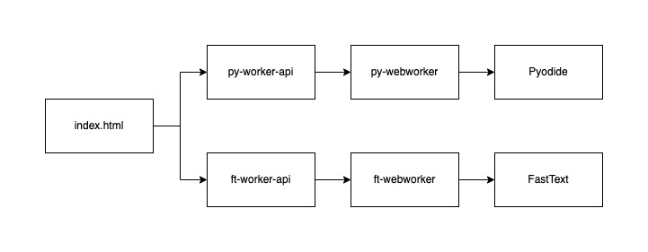

# pyodide-fasttext

Example code of using pyodide and fasttext. You can see the full detail [here](https://google.com) (Thai language)


## How to run locally

1. Pull this repository to your machine
2. Put your FastText model at ./fasttext/model.bin
3. Start Web Server

```
python3 -m http.server --directory public
```

4. Go to http://localhost:8000
5. You will see the result on the web. If you want to see the debug log, open the console.
